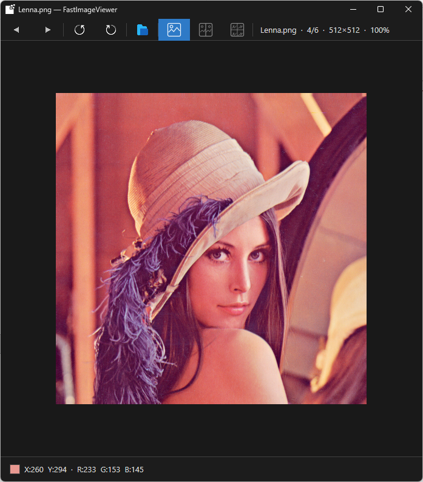

# FastImageViewer

A fast, lightweight image viewer for Windows built with Direct2D.

## Download

→ **[Latest Release](../../releases/latest)**

## Features

- **Multi-view mode** — View 1, 2, or 4 images simultaneously
- **Fast loading** — Background decoding with LRU cache (up to 20 images)
- **Zoom & Pan** — `Ctrl+Wheel` to zoom at cursor position, drag to pan
  - In multi-view mode, zoom applies independently per cell
- **Rotation** — Left/Right rotate (applies to all cells)
- **Pixel Inspector** — Real-time RGB/Grayscale values at cursor position
- **Drag & Drop** — Drop an image file directly onto the window
- **Keyboard navigation** — Arrow keys, Home/End

## Supported Formats

`BMP` `JPG` `JPEG` `PNG` `TIF` `TIFF` `WEBP` `GIF`

> GIF: first frame only (no animation) — full animation support planned

## Requirements

- Windows 10 or later (x64)
- No additional runtime required

## Keyboard Shortcuts

| Key | Action |
|-----|--------|
| `←` / `→` | Previous / Next image (N images at a time in multi-view) |
| `Home` / `End` | First / Last image |
| `Ctrl + Wheel` | Zoom in/out at cursor |
| `Wheel` | Previous / Next image |
| `Space` | Fit image to window |
| `Ctrl + O` | Open file dialog |

## Version History

### v1.1.0
- Added 1 / 2 / 4 image multi-view mode
- Independent zoom/pan per cell
- Parallel background decoding (4 threads)

### v1.0.0
- Initial release
